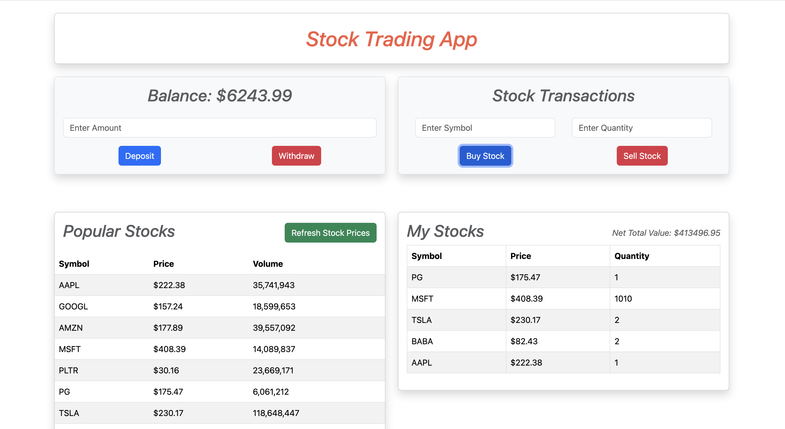
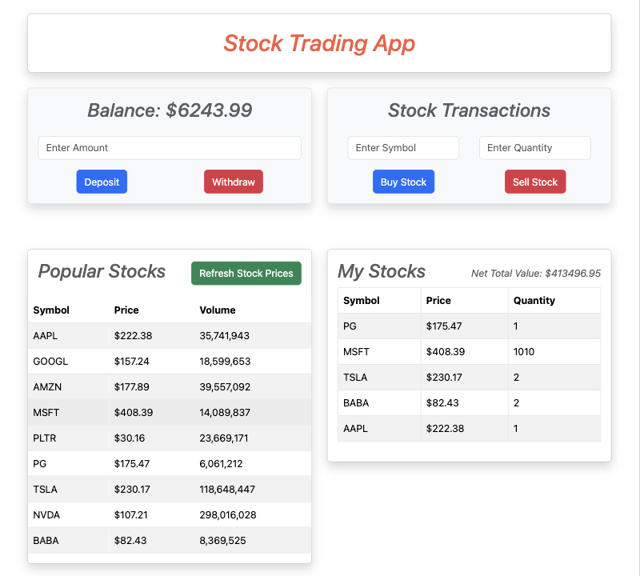
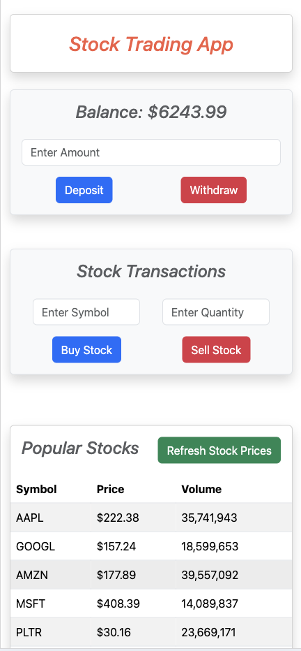
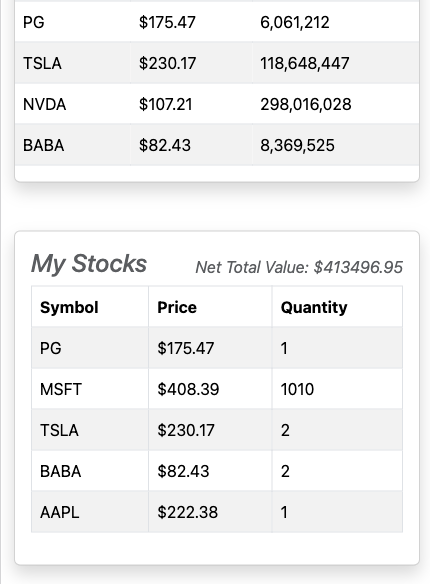

### Project Title: Stock Trading App

**Description:**
This application provides a platform for users to track and manage their stock portfolios. It allows users to buy and sell stocks, view real-time stock prices, and monitor their overall portfolio value.

**Technologies Used:**

- **Frontend:** React
- **State Management:** `useState` hook
- **Styling:** Bootstrap
- **Data Fetching:** `axios` API (or a suitable alternative like `fetch`)
- **Local Storage:** For storing user data and preferences
- **Real Time Stock Price API:** [https://rapidapi.com/StoxApi/api/real-time-quotes1]


**Prerequisites:**
- Node.js and npm (or yarn) installed on your system.

**Installation:**

1. Clone the repository:

   ```bash
   git clone https://github.com/asin211/stock-management-app.git
   ```

2. Navigate to the project directory:

   ```bash
   cd stock-trading-app
   ```

3. Install dependencies:

   ```bash
   npm install
   ```

4. Create .env file in the root directory & obtain your API Key from https://rapidapi.com/StoxApi/api/real-time-quotes1 and save in evvirnment variable

   ```bash
   REACT_APP_API_KEY=YOUR_API_KEY_HERE
   ```

**Running the Application:**

1. Start the development server:

   ```bash
   npm start
   ```

2. Open your web browser and navigate to `http://localhost:3000`.

**Hosted Demo:**

[https://asin211.github.io/stock-management-app/]

**Usage:**

- **Manage Balance:** Add/Remove balance in your account.
- **Check for Stocks:** Check for stocks avaialable and their prices.
- **Buy/Sell Stocks:** Enter the symbol and quantity, then click "Buy Stock" or "Sell Stock".
- **View Portfolio:** Check your "My Stocks" section to view your portfolio and its total value.

**Additional Notes:**

- Ensure you have a valid API key for the stock data service you're using.
- Customize the application to your preferences and requirements.
- For production deployment, consider using a build tool like Create React App or Next.js.

**Contributing:**

Contributions are welcome! Please follow these guidelines:
1. Fork the repository.
2. Create a new branch.
3. Make your changes.
4. Submit a pull request.

**License:**
[Feel free to use for personal/learning purposes.]


## Screenshots
### Desktop View
<br>

### Tablet View
<br>

### Mobile View

